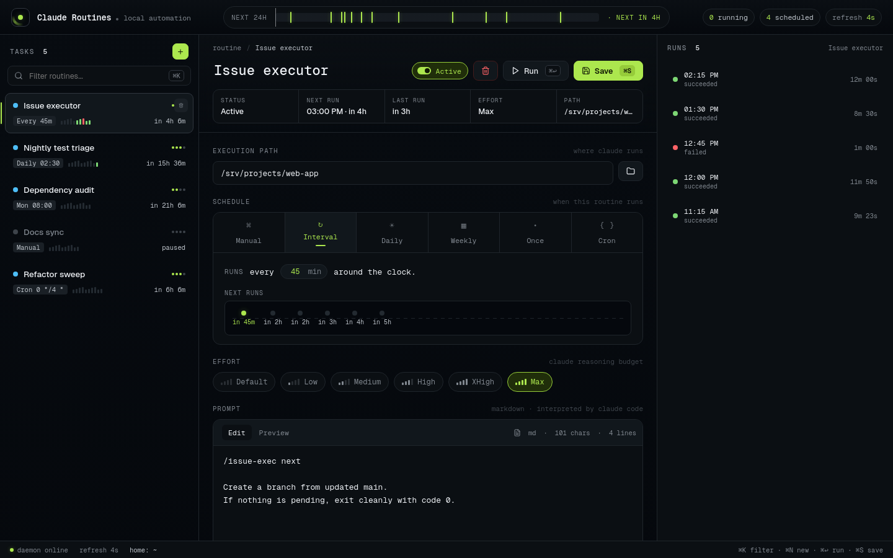
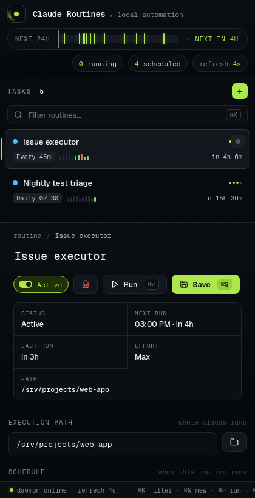
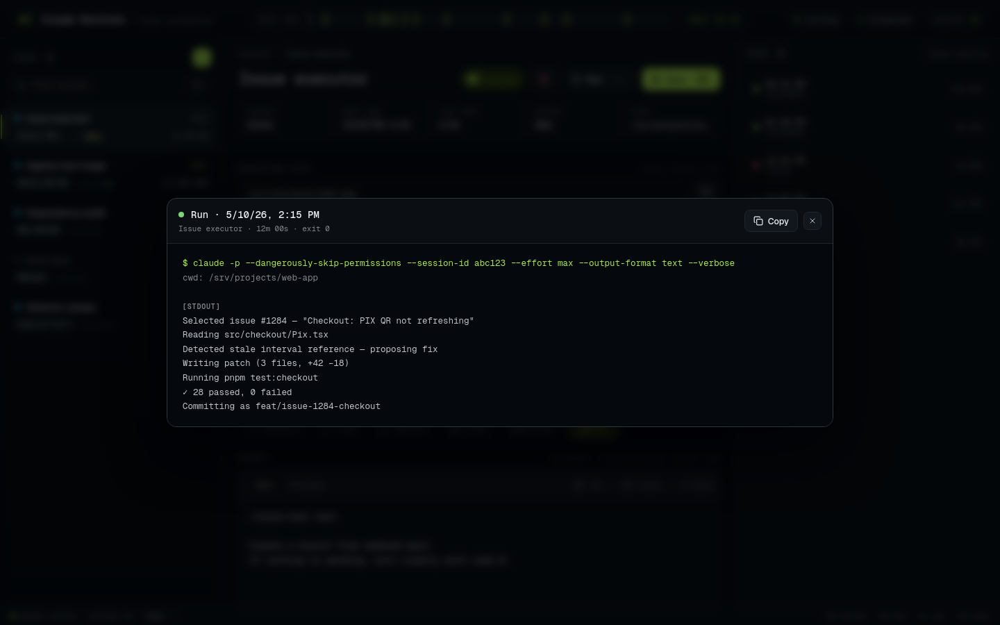

# Claude Routines

> A local control room for scheduled Claude Code CLI work. Author prompts in Markdown, pick a schedule and effort, hit save — and let your machine quietly drive Claude through the recurring stuff while you focus on the rest.



Claude Routines turns the Claude Code CLI into a dependable local worker. It is not a hosted SaaS, not a multi-user dashboard, and not a permission system. It is a focused, single-user command center that runs on your machine and gets out of your way.

If you already trust `claude --dangerously-skip-permissions` in the terminal and want recurring maintenance, cleanup, review, reporting or repository automation without babysitting a shell, this is for you.

---

## Why this exists

`claude` is wonderful. Cron is wonderful. Stitching them together by hand is not. You end up with a `crontab` of half-quoted shell, no idea which jobs are still active, no log retention, no resume after a crash, and no easy way to revise the prompt without diff-ing your `~/scripts` folder.

Claude Routines collapses that into one screen:

- **One place to write the prompt** in Markdown, with live preview.
- **One place to set the schedule** — manual, once, interval, daily, weekly, or full cron.
- **One place to pick the effort** (`low`, `medium`, `high`, `xhigh`, `max`) per routine.
- **One place to see what's running, what just ran, what's next, and what blew up.**
- **One place to resume** a stuck Claude session by its `--session-id`.

It is local-first by design. Your routines, your prompts, your execution history — all in a single JSON file under your control.

---

## Demo use cases

These are the routines that tend to earn back their setup cost in the first week:

| Routine | Schedule | Why it pays off |
|---|---|---|
| **Issue executor** — pop the next issue, branch, fix, push | every 45 min | Keeps the backlog flowing while you do deep work |
| **Nightly test triage** — read CI failures, post a digest in `/reports` | daily 02:30 | You wake up to a triaged board, not a red dashboard |
| **Dependency audit** — `npm audit`, propose safe upgrades, open PR | weekly Mon 08:00 | Stops the audit-debt snowball before it ships |
| **Docs sync** — regenerate API reference and commit if it changed | manual or cron | Docs that don't drift, without anyone remembering to write them |
| **Refactor sweep** — small targeted refactor PR, capped at 200 LOC | `0 */4 * * *` | Boy-Scout rule, automated |

The trick is that the prompt and the schedule live next to each other and stay versioned with the routine — you can iterate the prompt the same way you iterate any other code.

---

## What it looks like

A three-pane IDE-style shell. Tasks on the left, the routine you're editing in the middle, runs of the selected routine on the right. Click a run to open the full output in a fullscreen modal.

| Desktop | Mobile | Run output |
|---|---|---|
|  |  |  |

Design highlights:
- Dark slate base with one electric-lime accent reserved for action and live state — no AI gradients, no glass panels, no marketing gloss.
- Pulsing status orbs, sparkline of the last ten runs per task, humanized schedule chips ("Every 45m", "Daily 02:30").
- A 24h ribbon at the top showing every upcoming tick across every active routine.
- Geist + Geist Mono. Fully responsive down to phone width. Keyboard shortcuts for everything you do twice a day.

---

## Quick start

You need:

- Node.js 20 or newer.
- npm.
- Claude Code CLI installed and available as `claude` in the same shell that starts the daemon.
- Claude Code CLI authenticated and able to run `claude -p`.
- A modern browser.

```bash
git clone https://github.com/fabiootempesta/claude-routines.git
cd claude-routines
npm install
npm run build
npm run daemon:start
```

Open:

```text
http://localhost:4273
```

The daemon also prints LAN URLs when it starts (`http://192.168.1.20:4273`), so you can drive it from a tablet or phone on the same network.

---

## Security model

Claude Routines is local-first, but it can run powerful commands.

Each routine executes:

```bash
claude -p --dangerously-skip-permissions --session-id <uuid> [--effort <level>] --output-format text --verbose
```

The Markdown prompt is sent through stdin. That means a routine can modify files, run commands, and act inside the selected working directory **without interactive approval**. Use it only on machines and repositories where that is acceptable. Do not expose the app to an untrusted network. There is no auth layer; if you need one, bind to localhost (`HOST=127.0.0.1`).

---

## Daily use

```bash
npm run daemon:status     # is it running?
npm run daemon:stop       # stop it
PORT=4280 npm run daemon:start              # different port
HOST=127.0.0.1 npm run daemon:start         # localhost only
CLAUDE_ROUTINES_DB=/abs/path/db.json npm run daemon:start   # custom DB
```

By default, Claude Routines writes:

- Tasks and executions: `data/db.json`
- Server PID: `runtime/server.pid`
- Server log: `runtime/server.log`

The database is a single JSON file. Back it up if your routine history matters.

---

## Creating a routine

1. Click the lime **+** in the sidebar.
2. Name it.
3. Set the execution path to an absolute directory (usually a repository).
4. Pick a schedule — the schedule reads as a sentence and shows the next six firings on a tiny timeline.
5. Pick an effort, or leave it as **Default** to let the CLI decide.
6. Write the prompt in Markdown. Toggle **Preview** to sanity-check.
7. **Save** (`⌘S` / `Ctrl+S`).
8. Hit **Run** (`⌘↩` / `Ctrl+Enter`) for a manual fire, or wait for the schedule.

Good routines are explicit: include the goal, the constraints, the verification step, and what Claude should report when it finishes. Treat the prompt like a tiny runbook, not a wish.

### Keyboard shortcuts

| Shortcut | Action |
|---|---|
| `⌘N` / `Ctrl+N` | New routine |
| `⌘K` / `Ctrl+K` | Focus the routine filter |
| `⌘↩` / `Ctrl+Enter` | Run the selected routine now |
| `⌘S` / `Ctrl+S` | Save the routine |
| `Esc` | Close the run output modal |

---

## Recovering a stuck run

If the OS or a power loss killed the Claude process while a routine was running, that execution becomes **stale**. Open it from the runs panel and click **Continue** — Claude Routines starts a fresh, tracked execution that resumes the original Claude Code session by its `--session-id`. No work lost.

---

## Development

Two terminals for hot reload:

```bash
npm run dev                          # terminal 1: server
npx vite --host 0.0.0.0              # terminal 2: client
```

Then open `http://localhost:5273`. Vite proxies `/api` to the backend on port `4273`.

Other commands:

```bash
npm run build                        # full build (client + server)
npm test                             # vitest run
```

The codebase is small and intentionally so:

```
src/
  client/        React + TypeScript UI (App.tsx, styles.css, executionState.ts)
  server/        Express + Zod API, runner, scheduler, JSON store
scripts/
  daemon.mjs     start / stop / status helper that backgrounds the server
tests/           vitest suites (server + client)
```

---

## Troubleshooting

| Message | Fix |
|---|---|
| `Build not found` | `npm run build` before `npm run daemon:start` |
| `claude: command not found` | Install Claude Code CLI; verify `claude --version` works in the same shell |
| `Path must be absolute` | Use `/Users/you/project`, not `~/project` |
| `Path must point to a directory` | Create the directory first |
| `Port already in use` | `PORT=4280 npm run daemon:start` |
| The UI says the client has not been built | `npm run build` |

---

## What this is not

- Not a hosted workflow platform.
- Not a multi-user dashboard.
- Not a permissions or audit system.
- Not a replacement for serious CI/CD when you need it.

It is a focused local command center for scheduled Claude Code CLI work, and it will stay focused.

---

## Contributing

Issues and PRs welcome. The bar is: keep it local, keep it small, keep state visible. If you're proposing a new feature, please describe the routine you'd write with it — concrete examples sharpen the design conversation faster than abstract ones.

## License

MIT — see [LICENSE](LICENSE).
